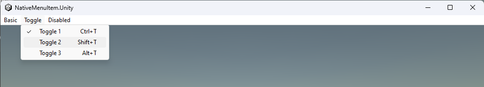

# Native Menu Bar for Unity

This plugin provides native menu bar functionalities for Windows builds using Unity.

# Feature

| Features/Plateforms    | Windows   | Mac           | Linux         | Editor        |
|------------------------|-----------|---------------|---------------|---------------|
| Nested MenuItems       | Unlimited | Not Supported | Not Supported | Not Supported |
| Enabled/Disabled state | Supported | Not Supported | Not Supported | Not Supported |
| Toggle state           | Supported | Not Supported | Not Supported | Not Supported |
| Keyboard shortcut      | Supported | Not Supported | Not Supported | Not Supported |

Currently only Windows platform is supported

# Usage

 - Download the latest package from the release
 - Add it into your Unity project either in the *Assets* folder or inside the *Packages* folder
 - Add the *MenuBar* component to any gameObject
 - Fill the component settings using the inspector

You can follow the example in the sample Unity project under *NativeMenuBar.Unity*